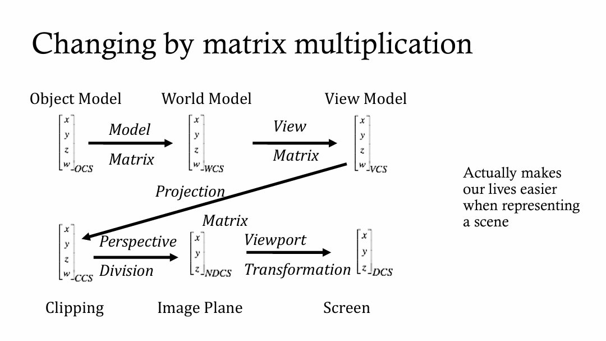

- [渲染管线](#渲染管线)
- [矩阵变换](#矩阵变换)
  - [投影矩阵的推导](#投影矩阵的推导)
    - [左右手坐标系](#左右手坐标系)
    - [投影变换](#投影变换)
      - [正交投影](#正交投影)
      - [透视投影](#透视投影)
  - [透视除法](#透视除法)
- [OpenGL \& GLSL](#opengl--glsl)
  - [着色器传值](#着色器传值)
    - [**顶点着色器（Vertex Shader）**](#顶点着色器vertex-shader)
    - [**片段着色器（Fragment Shader）**](#片段着色器fragment-shader)
- [毕业设计 Infinite Voxel World](#毕业设计-infinite-voxel-world)
    - [1. 噪声地形区块生成](#1-噪声地形区块生成)
    - [2. 体素相邻面剔除](#2-体素相邻面剔除)
    - [3. 渲染与地形生成的多线程实现](#3-渲染与地形生成的多线程实现)
    - [4. 视锥体剔除](#4-视锥体剔除)
    - [5. 区块顶点打包VAO/VBO](#5-区块顶点打包vaovbo)
    - [6. 八叉树](#6-八叉树)
- [光线追踪 Raytracing](#光线追踪-raytracing)
    - [1. 计算相机射线的方向](#1-计算相机射线的方向)
    - [2. 找到与光线相交的最近的三角形及距离](#2-找到与光线相交的最近的三角形及距离)
    - [3. 光线与三角形相交检测](#3-光线与三角形相交检测)
    - [4. 反射光线的计算](#4-反射光线的计算)
    - [4. 光线的递归追踪](#4-光线的递归追踪)
    - [蒙特卡洛方法的步骤](#蒙特卡洛方法的步骤)
      - [间接光照](#间接光照)
      - [直接光照](#直接光照)
    - [BRDF双向反射分布函数](#brdf双向反射分布函数)
- [光栅化 Rasterization](#光栅化-rasterization)
    - [1. 高度图转换为顶点坐标](#1-高度图转换为顶点坐标)
    - [2. 法线贴图](#2-法线贴图)
    - [3. blinn-phong光照模型](#3-blinn-phong光照模型)
    - [Blinn-Phong与Phong模型的区别](#blinn-phong与phong模型的区别)
      - [阴影是如何实现的](#阴影是如何实现的)
- [雪豹引擎 Snow Leopard Engine](#雪豹引擎-snow-leopard-engine)
    - [1. 物理系统](#1-物理系统)
      - [PhysX的一些细节原理](#physx的一些细节原理)
    - [2. 事件回调](#2-事件回调)
    - [3. 编辑器UI](#3-编辑器ui)
    - [4. 单例模式](#4-单例模式)
- [几何处理 Geometry Processing](#几何处理-geometry-processing)
  - [1. 曲面loop细分](#1-曲面loop细分)
  - [2. 纹理映射](#2-纹理映射)
  - [3. 流型](#3-流型)
- [动画模拟 Animation and Simulation](#动画模拟-animation-and-simulation)
  - [骨骼动画](#骨骼动画)
- [Unreal Engine 描边](#unreal-engine-描边)
  - [1. 描边原理](#1-描边原理)
- [Vulkan](#vulkan)
  - [描述符, 描述符集, 描述符池](#描述符-描述符集-描述符池)

# 渲染管线

- **顶点输入**: 将几何数据输入
- (可编程)**顶点着色器**: 将几何数据进行顶点处理(MVP变换等)
- **图元装配**: 封装成点, 线, 三角形等图元
- (可配置)**几何着色器**: 对图元进行二次处理(扩展多个三角形等)
- **光栅化**: 将图元转换为像素(片元), 确定覆盖像素范围
- (可编程)**片元着色器**: 计算颜色(blinn-phong等)
- **像素操作**: 对像素进行混合, 测试等(深度测试, 丢弃被挡住的三角)
- **帧缓冲输出**: 写入缓冲区, 交换链等

三个阶段：应用阶段、几何阶段、光栅化阶段

应用阶段：

- 准备场景数据，做粗粒度剔除
- 设置渲染的状态
- 调用drawcall

几何阶段：

- 顶点着色器：处理输入的顶点信息，进行变换到裁剪空间
- 曲面细分着色器：细分图元
- 几何着色器：产生更多的图元
- 裁剪：如果在摄像机视野外的就直接丢弃，如果在视野范围内外都有的部分就需要裁剪留下可见的部分
- 屏幕映射：将裁剪空间转换到屏幕空间，裁剪空间是[-1,1]的区域内，转换到2维屏幕空间里。

光栅化阶段：

- 三角形设置：根据之前的顶点，计算出三角形的边界
- 三角形遍历：遍历图元，计算哪些图元是在三角形的内部。
- 片元着色器：对需要渲染的图元进行着色等
- 逐片元操作：修改颜色、深度缓冲、进行混合等等操作。

# 矩阵变换



Object Model    -Model Matrix->         World Model (世界坐标)

World Model     -View Matrix->          View Model (视图坐标)

View Model      -Projection Matrix->    Clip Model (裁剪坐标)

Clip Model      -Perspective Divide->   NDC Model (归一化设备坐标)

NDC Model       -Viewport Transform->   Screen Model (屏幕坐标)

## 投影矩阵的推导

### 左右手坐标系
1. 大多数图形学用的是右手坐标系
2. OpenGL实际上不指定坐标系, 而是因为glm库默认使用右手坐标系
3. Unity,Unreal,DirectX等引擎都是左手坐标系

- 右手坐标系: x轴向右, y轴向上, z轴向外
- 左手坐标系: x轴向右, y轴向上, z轴向内

### 投影变换

投影变换: 把相机空间的坐标转换到裁剪坐标系
- 正交投影
- 透视投影

#### 正交投影

把从(left, bottom, near)到(right, top, far)的立方体映射到单位立方体
1. 先将中心点移动到原点
2. (left,button,near) -> (-1,-1,-1)
3. (right, top, far) -> (1,1,1)

#### 透视投影

把视锥体映射到单位立方体
- 看向的方向是-z方向(右手系)
1. 先做一次变换, 将视锥体压缩成长方体
2. 近平面所有点不变, 其他xy根据z线性缩放
3. (x,y,z,1) -> (?,?,)

透视投影矩阵的参数:

- f: 远裁剪面
- n: 近裁剪面
- aspect: 宽高比
- radians: 视野角度

透视投影矩阵的公式:

$$
\begin{bmatrix}
\frac{1}{aspect * tan(radians/2)} & 0 & 0 & 0 \\
0 & \frac{1}{tan(radians/2)} & 0 & 0 \\
0 & 0 & -\frac{f+n}{f-n} & -\frac{2*f*n}{f-n} \\
0 & 0 & -1 & 0
\end{bmatrix}
$$

将裁剪坐标系转换到NDC坐标系, 通过透视除法, 将坐标系转换到[-1, 1]的范围内

## 透视除法

透视除法: 将裁剪坐标系的坐标除以w分量, 得到NDC坐标系的坐标

$$
\begin{bmatrix}
x/w \\
y/w \\
z/w
\end{bmatrix}
$$

Viewport Transform(视口变换): 将NDC坐标系的坐标转换到屏幕坐标系的坐标

# OpenGL & GLSL

Uniform: 一般是在CPU中设置的, 例如光照方向, 光照颜色等

- C++ 中获取 uniform 的位置: `glGetUniformLocation(shaderProgram, "uniformName")`
- OpenGL 的函数将数据传递到该位置: `glUniform3f(location, value1, value2, value3)`

in(Attribute): 一般是在顶点着色器中设置的, 例如顶点坐标, 纹理坐标等

- C++ 中获取 in 的位置: `glGetAttribLocation(shaderProgram, "inName")`
- OpenGL 的函数将数据传递到该位置: `glVertexAttribPointer(location, size, type, normalized, stride, offset)`

out: 一般是在顶点着色器写, 在片段着色器用in接收

- 顶点着色器: `out vec3 FragPos;`
- 片段着色器: `in vec3 FragPos;`

VBO：`存储`实际的顶点数据，比如顶点坐标、颜色、法线等。每个 VBO 存储一类顶点数据。

VAO：一个 VAO 可以`管理`多个 VBO，比如一个 VBO 用于存储顶点位置，一个 VBO 用于存储顶点颜色

EBO：`索引缓冲对象`，用于`索引绘制`，避免重复绘制顶点

## 着色器传值

### **顶点着色器（Vertex Shader）**

- **输入：**
  - 顶点属性（Vertex Attributes）：如顶点的位置、法线、颜色、纹理坐标等。通过OpenGL函数`glVertexAttribPointer`指定，通常从VBO（顶点缓冲对象）中传递。
  - 统一变量（Uniforms）：全局变量，例如投影矩阵、视图矩阵、模型矩阵等，使用`glUniform*`函数传递。
  - 常量变量（Constants）：编译期已知的常量值。
- **输出：**
  - 裁剪空间中的顶点坐标（Clip Space Coordinates）：经过模型、视图、投影矩阵变换后的顶点位置。
  - 其他插值属性：例如颜色、法线、纹理坐标等，会传递到片段着色器进行插值。

### **片段着色器（Fragment Shader）**

- **输入：**
  - 来自顶点着色器、细分着色器或几何着色器插值后的数据（如插值后的顶点颜色、法线、纹理坐标等）。
  - 统一变量：如光照参数、纹理等。
- **输出：**
  - 每个片段（Fragment）的颜色值。通过`gl_FragColor`或现代OpenGL使用自定义输出变量。
  - 深度值（可选），通过修改`gl_FragDepth`。

# 毕业设计 Infinite Voxel World

### 1. 噪声地形区块生成

1. 用三维布尔类型的数组储存体素是否被填充
2. 通过噪声值计算地形的高度, 留出地形最小高度
3. 通过噪声值判断地表下方一定高度y之下是否为洞穴
4.

### 2. 体素相邻面剔除

通过获遍历数组每一个体素, 通过它六个方向的相邻体素的bool值判断相邻位置是否有体素, 如果没有体素, 则将此面的顶点添加进可以见面顶点数组中

### 3. 渲染与地形生成的多线程实现

原子

```c++
std::atomic<bool> updateChunks(true);
```

单独用一个线程来控制区块更新

在 ChunkManager 类中使用Mutex锁来控制可能冲突的资源

```c++
std::mutex chunksMutex; // Mutex lock
```

在需要对 chunks 进行修改时, 需要先lock

```c++
std::lock_guard<std::mutex> lock(chunksMutex);
```

### 4. 视锥体剔除

用 vec4 plane[6] 表示视锥体的6个面, 每个面的方程式为ax + by + cz + d = 0, 其中 a, b, c, d 在 vec4 中的位置是 (a, b, c, d)

```c++
planes[0] = glm::vec4(
    projectionViewMatrix[0][3] + projectionViewMatrix[0][0], // Left
    projectionViewMatrix[1][3] + projectionViewMatrix[1][0],
    projectionViewMatrix[2][3] + projectionViewMatrix[2][0],
    projectionViewMatrix[3][3] + projectionViewMatrix[3][0]);

```

传入的参数为区块的两个边界顶点坐标 max, min 分别是坐标 x y z 的最大值点和最小值点

通过方法 isAABBInFrustum , 以法向量 (vec4:plane[i]的前三个元素构成的vec3) 的x y z 正负判断, 如果 plane[i].x 为正, 则选择体素顶点中x最大的值: max.x, 以此类推, 得到最后结果点 P

通过法向量与 P 点的点成, 计算距离, w 是视锥体的各个平面的偏移量
如果结果小于0 , 则说明这个点在平面外, 返回 false , 如果所有平面都检查通过, 则返回 true

```c++
bool isAABBInFrustum(const glm::vec3& min, const glm::vec3& max) const {
        for (int i = 0; i < 6; i++) {
            glm::vec3 p = min;
            if (planes[i].x >= 0) p.x = max.x;
            if (planes[i].y >= 0) p.y = max.y;
            if (planes[i].z >= 0) p.z = max.z;
            if (glm::dot(glm::vec3(planes[i]), p) + planes[i].w < 0) {
                return false;
            }
        }
        return true;
    }
```

### 5. 区块顶点打包VAO/VBO

VAO是顶点数组对象, VBO是顶点缓冲对象, 这里将一个区块的所有顶点绑定到一个VBO上

```c++
glBindBuffer(GL_ARRAY_BUFFER, VBO);
glBufferData(GL_ARRAY_BUFFER, vertices.size() * sizeof(Vertex), vertices.data(), GL_STATIC_DRAW);
```

### 6. 八叉树

八叉树是一种树形数据结构, 每个节点有八个子节点, 用于空间划分

# 光线追踪 Raytracing

### 1. 计算相机射线的方向

计算屏幕比例, 转换到标准化设备坐标系(NDCS)下, 根据屏幕比例调整坐标

光线的起点是相机位置, 方向是从相机位置到屏幕上的点

如果是正交投影, 则光线方向是固定的, 与相机位置无关

### 2. 找到与光线相交的最近的三角形及距离

初始化一个最近距离为无穷大的变量, 遍历所有三角形, 计算光线与三角形的交点, 如果交点在三角形内部, 且距离小于最近距离, 则更新最近距离和最近三角形

如果未击中任何三角形, 则返回的距离值为-1

### 3. 光线与三角形相交检测

光线可以表示为: P(t) = r.origin + t * r.direction

- P(t)是光线上的点
- r.origin是光线的起点
- r.direction是光线的方向
- t是光线的长度

三角形所在平面的方程: (P-P0)*N = 0

- P是平面上的任意点
- P0是平面上的一个已知点(可以用三角形的其中一个顶点)
- N是平面的法向量

将光线方程代入平面方程, 得到光线与平面的交点

(r.origin + t *r.direction - P0)* N = 0

t = (P0 - r.origin) *N / (r.direction* N)

P = r.origin + t * r.direction

```cpp
float result = (verts[0].Point() - r.origin).dot(nVector) / r.direction.dot(nVector);
Cartesian3 P = r.origin + r.direction * result;
```

计算三角形的边向量, 将其与顶点指向P的向量进行叉乘, 如果结果同向(点乘大于0), 则P在三角形内部

```cpp
if(nAPAB.dot(nBPBC) >= 0 && nBPBC.dot(nCPCA) >= 0){ return result;}
else{ return -1.0f;}
```

### 4. 反射光线的计算

反射光线的方向是入射光线与法线的夹角的反射

反射光线的方向等于入射光线的方向减去其在法线方向上的分量的两倍

rOut = rIn - 2 *(rIn* n) * n

注意: 将反射光线的起始点进行微小偏移, 防止光线与发生该反射的三角形再次相交

### 4. 光线的递归追踪

当最近的三角形距离大于0(前面方法提到若未击中则返回-1)时说明击中了三角形

当三角形的材质反射率大于0时, 说明该三角形是反射的

将反射光线作为参数, N-1次递归调用TraceRay函数, 得到反射光线的颜色

### 蒙特卡洛方法的步骤

1. 每个像素点发射n条光线
2. 每条光线与场景中的物体相交
3. 计算光线与物体的交点
4. 交点处根据BRDF计算光照
5. 递归计算间接光照(PDF是光线在半球上的概率密度函数)
6. 将直接光照和间接光照相加
7. 将结果写入像素(n条光线的平均值)

#### 间接光照

PDF: 概率密度函数, 用于计算光线在半球上的概率密度

- 漫反射表面：使用余弦加权采样从半球上随机选择一个方向。
- 镜面反射表面：使用重要性采样从高光区域附近采样反射方向。
- 透明材质：可能会根据 Fresnel 方程来决定光线是反射还是折射，如果折射则使用 Snell's Law 计算折射方向。

斯涅尔定律:

- n1 *sin(theta1) = n2* sin(theta2)
- n1和n2分别是两种介质的折射率
- theta1和theta2分别是入射角和折射角

菲涅尔方程:

- 当对象透明时, 计算折射光线和反射光线的颜色
- 施利克近似公式: R(theta) = R0 + (1 - R0) * (1 - cos(theta))^5
- R(theta)是反射率
- R0是入射光线垂直时的反射率, 计算公式: ((n1 - n2) / (n1 + n2))^2, n1和n2分别是两种介质的折射率
- theta是入射角

#### 直接光照

- 直接光照是指光源直接照射到表面上的光线
- 通过光线与光源的相交检测, 计算光线与光源的交点
- 计算光线与光源的距离, 计算光源的光照强度
- 计算光线与光源的交点处的光照

1. 阴影: 通过光线与光源的相交检测, 如果光线与光源之间有物体, 则说明光线处于阴影中
2. 光照: 通过光线与光源的距离, 计算光源的光照强度

### BRDF双向反射分布函数

BRDF是双向反射分布函数, 用于描述光线在物体表面的反射特性

- $f_r(w_i, w_o) = f_r(w_i, w_o) * cos(theta_i) / PI$
- $f_r(w_i, w_o)$是BRDF
- $w_i$是入射光线方向
- $w_o$是出射光线方向
- $theta_i$是入射光线与法线的夹角

# 光栅化 Rasterization

### 1. 高度图转换为顶点坐标

在顶点着色器中, 获取高度图的像素值, 其RGB值表示高度, 将r乘以256*256, g乘以256, b相加, 再乘以高度缩放系数, 得到高度值

```glsl
vec3 heightColor = texture(HeightTexture, UV).rgb;
float height_weight = 2500.0;
height = (heightColor.r*256*256 + heightColor.g*256 + heightColor.b)*heightScale/height_weight;
```

将以高度图为基础计算出的高度值加到原始的均匀分布的顶点网格坐标上, 得到新的顶点坐标(此时仍是在对象坐标系下)

```glsl
vec3 vertexPosition = vertexPosition_ocs + vec3(0, height, 0);
```

将新的顶点坐标通过乘以MVP矩阵转换到裁剪坐标系下

```glsl
gl_Position = MVP * vec4(vertexPosition,1.0);
```

### 2. 法线贴图

TBN矩阵是由法线, 切线, 副切线构成的矩阵, 用于将切线空间下的法线转换到世界空间下的法线

```glsl
vec3 normal_TBN = normalDir_VCS; 
vec3 tangent_TBN =  vec3(1,0,0); 
vec3 bitangent_TBN = vec3(0,0,1);
```

Gram-Schmidt 正交化方法

```glsl
normal_TBN = normal_TBN;
tangent_TBN = normalize(tangent_TBN - dot(normal_TBN,tangent_TBN));//tangent_TBN * 
bitangent_TBN = normalize(cross(tangent_TBN,normal_TBN));

mat3 TBN = mat3(tangent_TBN,bitangent_TBN,normal_TBN);
```

法线贴图的信息是在切线空间下的, 通过切线空间下的法线贴图, 将法线贴图的RGB值转换为切线空间下的法线值

注意: 法线贴图的RGB值范围是[0,1], 而切线空间中和法线的坐标范围是[-1,1], 所以要通过乘以2再减去1, 得到[-1,1]的范围

```glsl
vec3 normalMapColor = texture(NormalMapTexture, tiledUV ).rgb;
vec3 normalMapValue = normalMapColor * 2.0 - 1.0;
```

将法线贴图的法线值转换到世界空间下的法线值

```glsl
vec3 normalDir_VCS = normalize(TBN * normalMapValue);
```

### 3. blinn-phong光照模型

blinn-phong光照模型是由环境光, 漫反射, 镜面反射(高光)三部分组成

lightColor = ambientColor + diffuseColor + specularColor

**Blinn-Phong光照模型**是一种用于计算三维场景中表面光照的经典**局部光照模型**，它是对传统Phong光照模型的一种改进，尤其是对**高光反射**的处理更加高效。Blinn-Phong模型经常用于实时渲染、游戏和图形应用中，因为它平衡了计算复杂度和视觉效果。

1. **环境光（Ambient Light）**：模拟场景中来自各个方向的全局光，给物体一个基本的亮度，即使没有直接光照到它。这部分光不受光源的影响，只是一个固定值。

   公式：  
   \[
   I_{ambient} = k_{ambient} \cdot I_{light}
   \]  
   其中，\( k_{ambient} \) 是环境光系数，\( I_{light} \) 是光源的强度。

2. **漫反射（Diffuse Reflection）**：模拟光线与粗糙表面发生散射，光线被均匀地向各个方向反射。漫反射的强度取决于光线照射到表面的角度，即光线和表面法线的夹角。

   公式：  
   \[
   I_{diffuse} = k_{diffuse} \cdot I_{light} \cdot \max(0, \mathbf{L} \cdot \mathbf{N})
   \]  
   其中，\( k_{diffuse} \) 是漫反射系数，\( \mathbf{L} \) 是光线方向向量，\( \mathbf{N} \) 是表面法向量，\( I_{light} \) 是光源强度。

3. **高光反射（Specular Reflection）**：模拟光线在光滑表面发生镜面反射，表现出闪亮的高光效果。Blinn-Phong模型通过引入**半程向量（Halfway Vector）**来简化传统Phong模型中的反射向量计算，从而加速高光的计算。

   公式：  
   \[
   I_{specular} = k_{specular} \cdot I_{light} \cdot \max(0, \mathbf{N} \cdot \mathbf{H})^{\alpha}
   \]  
   其中，\( k_{specular} \) 是高光反射系数，\( \mathbf{H} \) 是**半程向量**，定义为光线方向向量 \( \mathbf{L} \) 与视线方向向量 \( \mathbf{V} \) 的单位化加和：  
   \[
   \mathbf{H} = \frac{\mathbf{L} + \mathbf{V}}{|\mathbf{L} + \mathbf{V}|}
   \]  
   \( \alpha \) 是光泽度系数，控制高光的散射程度，值越大，高光越集中。

### Blinn-Phong与Phong模型的区别

- **Phong模型**：需要计算**反射向量** \( \mathbf{R} \) 和视线向量 \( \mathbf{V} \) 的夹角，用于计算高光反射部分，计算代价较高。
- **Blinn-Phong模型**：通过使用半程向量 \( \mathbf{H} \)，只需要计算法向量 \( \mathbf{N} \) 和 \( \mathbf{H} \) 的夹角，避免了繁琐的反射向量计算，效率更高。

#### 阴影是如何实现的

（1）把摄像机放在光源进行光栅化得到一张存储深度信息的纹理图
（2）从真相机的位置进行光栅化，如果大于纹理图在该点的深度，则说明处于阴影中

# 雪豹引擎 Snow Leopard Engine

### 1. 物理系统

Nividia PhysX 5: 一个物理引擎, 用于模拟物体的运动, 碰撞, 重力等

用组件的形式添加到物体上, 例如刚体组件, 碰撞体组件, 关节组件等

Mesh Collider在 PhysX 中有两种类型: Convex Mesh Collider 和 Triangle Mesh Collider

- Convex Mesh Collider: 用于简单的几何体, 性能更好
- Triangle Mesh Collider: 用于复杂的几何体, 但是不会计算运动学
- (最开始用的Triangle Mesh Collider, 但是发现不动了, 用Convex Mesh Collider就好了)

#### PhysX的一些细节原理

1. 速度太快导致穿透的原因:
   - 速度太快, 两帧之间的位移太大, 会导致穿透
2. 解决穿透的方法:
   - 通过计算两帧之间的位移, 使位移的连线与碰撞体的表面相交, 从而解决穿透

### 2. 事件回调

监听, 订阅, 发布事件, 用于解耦模块之间的关系

- 订阅: Subscribe函数, 用于订阅事件
- 发布: TriggerEvent函数, 用于发布事件
- 监听: OnEvent函数, 用于监听事件

1. 实体的创建和销毁：

- 当我们在场景中创建或销毁一个实体（Entity）时，系统会触发相应的事件。
- 例如，调用 TriggerEntityDestroy() 时，会触发一个销毁事件，告诉系统和其他订阅者，这个实体已经被销毁。

2. 事件的触发与处理：

- 在 TriggerEvent 函数中，系统会遍历所有订阅了这个事件类型的处理器（比如某些模块或对象），并让这些处理器对事件做出反应。
- 假如你订阅了“实体创建”事件，那么每当一个实体被创建时，你就会收到通知，系统会自动调用你注册的处理函数，处理这个事件。

3. 订阅机制：

- 订阅者可以通过两种方式来监听事件：
    1. 全局订阅：每当某种类型的事件（比如“实体创建”）发生时，所有订阅了这种事件的处理器都会收到通知，并执行相应的逻辑。
    2. 特定订阅：通过 handlerId，某些处理器只处理特定的事件（比如某个模块只关心某类特定的事件）。这可以避免广播所有处理器，直接调用需要的处理器

### 3. 编辑器UI

用Dear ImGui库实现编辑器UI, 用于调试, 设置参数等

- 多个窗口: 计算渲染窗口大小, 根据需求设置UI窗口坐标
- 按钮: ImGui::Button函数, 用于创建按钮
- 滑动条: ImGui::SliderFloat函数, 用于创建滑动条
- 文本框: ImGui::InputText函数, 用于创建文本框
- 轻量化, 易扩展

### 4. 单例模式

单例模式: 保证一个类仅有一个实例, 并提供一个访问它的全局访问点

- 优点:

# 几何处理 Geometry Processing

## 1. 曲面loop细分

1. 连接每条边的中点，得到新的顶点
2. 将所有顶点分为两类: 新顶点和旧顶点
3. 新顶点的坐标更新为: (A+B)*3/8 + (C+D)*1/8
   - 新顶点所在边的两个旧顶点的坐标: A, B
   - 新顶点相邻两个三角形的不共边的两个旧顶点的坐标: C, D
4. 旧顶点的坐标更新为: (1-n*u)* 旧顶点坐标 + u * 相邻旧顶点坐标之和
   - n = 旧顶点相邻的新顶点数
   - u = 3/16 if n = 3, u = 3/8n otherwise

## 2. 纹理映射

1. 建立半边(有向边)数据结构和邻接点信息
2. 识别边界: 找到没有配对的半边，从该边开始，沿着边界边的两个顶点遍历，直到回到起始边界
3. 创建正方形纹理: 根据边界点生成纹理坐标，处理非边界点的默认坐标
4. 使用Floater算法为网格中的每个顶点分配纹理坐标: 迭代更新每个非边界点的纹理坐标为其邻接点的平均值
5. 计算法线: 根据三角形的法线计算每个顶点的法线，并进行归一化处理

## 3. 流型

流型是一个局部欧几里得空间，可以用一个局部坐标系来描述，是一个局部的线性空间

用途:

1. 如果是流型, 可以简化碰撞计算, 因为边界比较清晰
2. 确保物体在运动时的物理行为可以被准确模拟

判断依据:

1. 表面不能自相交(即不能有自相交的三角形)
2. 每个顶点的邻接三角形不能共面

# 动画模拟 Animation and Simulation

## 骨骼动画

1. 骨骼树: 用于描述骨骼之间的关系
2. 顶点蒙皮: 通过骨骼的权重和顶点的位置，计算出顶点的最终位置(骨骼文件类似树结构，每个骨骼有父骨骼和子骨骼，每个骨骼有一个权重，每个顶点有多个骨骼)
3. 混合动画: 将多个动画混合在一起: 原理是将多个动画的关键帧进行线性插值

动画混合:

- 如果两个动画的关键帧数不同，可以通过插值的方式将两个动画的关键帧数调整为相同
- 通过权重值，可以调整两个动画的混合比例

# Unreal Engine 描边

## 1. 描边原理

1. 深度缓冲: 存储了每个像素的深度值
2. 法线缓冲: 存储了每个像素的法线值
3. 虚幻的后处理Volume: 是一个特殊的Actor，用于在场景中添加后处理效果, 可以获取场景中的深度缓冲和法线缓冲
4. 深度描边: 通过深度缓冲计算出每个像素的深度值，通过比较相邻像素的深度值，计算出边缘
5. 法线描边: 通过法线缓冲计算出每个像素的法线值，通过检查法线的变化量, 变化量大的地方为边缘

# Vulkan

## 描述符, 描述符集, 描述符池

描述符: 用于描述资源的数据结构, 包括资源类型, 访问权限等

描述符集: 用于存储描述符的集合, 用于绑定到管线上

描述符池: 用于存储描述符集的集合, 用于分配描述符集  

用于绑定到管线上, 用于访问资源
